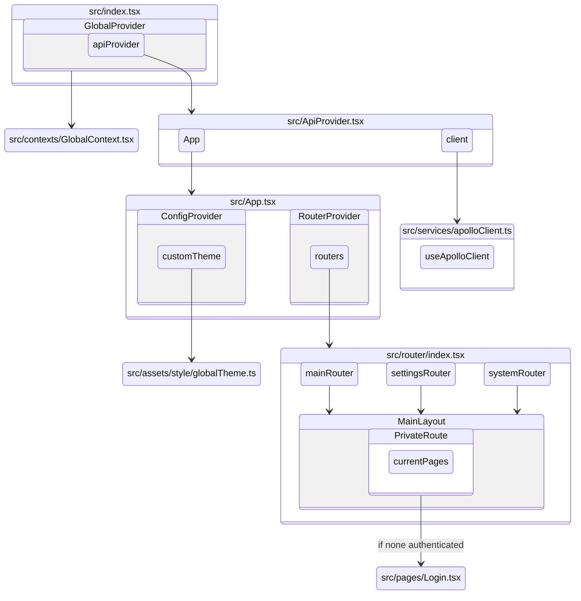

[TOC]
## Project Structure

### Folder Structure
```
Risk-Management-Frontend
├── src
│   ├── assets // 靜態資源
│   │   ├── images
│   │   ├── style
│   │   ├── types // 內層資料夾依照專案結構（graphql 沒有再細分）
│   │   ├── utils // 靜態 js function
│   ├── configs
│   │   ├── chartConfigs // 放置 charts 設定檔
│   ├── components // 除特別標示外 不可直接引用、串接資料及使用 contexts
│   │   ├── commons
│   │   ├── MainLayout // 內頁主結構（header, menu等）可放全站用 API, contexts，處理每次進各頁面相關邏輯
│   │   │   └──MainMenu // 頁面 Menu 設定
│   │   │   ├── UserMenu
│   │   │   ├── SystemMenu
│   │   ├── PrivateRoute // 確保內頁只可在已登入的狀態下顯示 可 contexts
│   └── contexts
│   └── graphql
│   │   ├── mutations
│   │   ├── queries
│   │   ├── lazyQueries
│   └── hooks
│   └── pages // 全站頁面管理（pages 內容不可以放在 components～～）
│   └── router
│   └── services // Apollo client 設定（含 refresh token 邏輯）
│   └── ApiProvider.tsx // 在這引入 services 的 Apollo 設定
│   └── App.tsx // 在這處理初始進站邏輯（含 verify token 邏輯）
│   └── index.tsx
├── .env // 環境變數
├── package.json
├── tsconfig.json
├── tsconfig.paths.json // alias path 設定檔
```

---

### Project Architecture Diagram

1. `./src/index.tsx` 為進入點，這層包含 `<GlobalProvider>` 及組件 `<ApiProvider>`
2. `<ApiProvider>` 中引入 `./services/apolloClient` 相關 Apollo 設定，並帶入主頁面組件 `<App>`


---

## Development Workflow

### Adding a New Page

1. 在 `pages/` 新增頁面檔案
1. 在 `router/` 對應的檔案中新增相關設定（詳見 [Router](###router)）
1. 在 `menu/` 對應的檔案中新增相關 Menu item（詳見 [Menu](###menu)）
1. 在 `.env` 對應的變數中新增對應 feature 字串（詳見 [.env](###.env)）

* 注意 Menu key 對應的位置，`menu list`, `router` 及 `.env` 都要寫入才會看的到頁面
* menu.key === router.menuName === .env feature 字串

### API Development Flow

1. 在 `graphql/` 新增 API query
1. 將該 query 引入指定頁面，並參考 apollo client hook 用法串接 API
1. 可在 `types/` 新增相關 query types，包含 variables & responses

* 底層 apollo client 設定在 `services/apolloClient`

---

## Detailed Structure

### MainLayout

### Menu
跟 `router`, `.env` 及頁面連動，詳見「新增頁面流程」

Menu List 基本架構
```
// 透過 useMenu 確認 Menu api (permissionMenu) 是否有該分頁，並轉換為 ant design Menu 格式
{
  key: 'system_account_groups',
  link: 'account-groups',
  title: 'Account Group',
  icon: TeamOutlined,
},
```

Menu 結構
```
├── MainMenu
│   ├── Home ('/')
│   ├── Real Time ('/real-time')
│   ├── System Management ('/account-groups') // directed to SystemMenu
├── UserMenu
│   ├── Account ('account')
│   ├── Password ('password')
│   ├── Preferences ('preferences')
│   ├── Authentication Log ('/authentication-log')
├── SystemMenu
│   ├── Account Group ('account-groups')
```

### Router
跟 `menu`, `.env` 及頁面連動，詳見「新增頁面流程」

Router List 基本架構
```
  // （Page Name 通常為自己 import 檔案的名稱，如果有兩個以上共用可參考 property extendComponent）
  [Page Name]: {
    title: 'Create New Branch', // MainLayout 上的 title
    path: '/account-groups/create-branch', // router 路徑
    crumb: ({ searchParams }: any) => [
      { title: 'System Management' },
      { title: 'Account Groups', link: 'account-groups' },
      { title: searchParams.get('branch') },
    ], // 麵包屑
    htmlTitle: ({ searchParams }: any) => `Edit Branch - ${searchParams.get('branch')}`, // document head 的 title
    requiredParams: [{ param: 'branch', required: true }], // 必填 searchParams
    importPath: 'SystemManagement/', // page 資料夾
    menuName: 'system_account_groups', // 對應的 menu key（字串跟後端共用）
    extendComponent: 'EditBranch', // 使用的 page component（如果跟其他的 Page 共用的話）
    componentProps: { editType: EditAccountStatus.Edit }, // Page Name 或 extendComponent 所需的 props
  }
```

### Context
引入點為 GlobalContext
```
const globalContextValues = {
  theme: themeContext,
  authenticated: authenticatedContext,
  userSelf: userSelfContext,
  notification: notificationContext,
}
```
Context 內容
```
├── themeContext
│   ├── theme, setTheme // Light or Dark
├── authenticatedContext
│   ├── isAuthenticated, setIsAuthenticated // Login or not
│   ├── isForceLogout, setIsForceLogout // 控制是否顯示全域強制登出的通知訊息
├── userSelfContext
│   ├── username, setUsername
│   ├── userEmail, setUserEmail
│   ├── fontSize, setFontSize
│   ├── dateFormat, setDateFormat
│   ├── timeFormat, setTimeFormat
│   ├── negativeShowMinus, setNegativeShowMinus
├── notificationContext
│   ├── globalContextHolder // 統一放在 <GlobalContext.Provider> 裡
│   ├── openGlobalNotification
│   ├── globalNotificationSuccess // 顯示成功通知框
│   ├── globalNotificationError // 顯示錯誤通知框
```

### Hook
| **Hook Name** | **功能** | **參數** | **回傳值** | **變數範例** | **輸出範例** |
|--|--|--|--|--|--|
|||||||
### Utils

| **Function Name** | **功能** | **參數** | **回傳值** | **變數範例** | **輸出範例** |
|--|--|--|--|--|--|
| `formatTimestamp` | 根據目前時間顯示指定時間為多久之前 | `Date` | `string` | `(new Date(2025-02-20T06:36:07))` | "3 days ago"<br>"about 23 hours ago" |
| `GraphQLErrorMsg` | 回傳 ApolloError 後端錯誤訊息或預設訊息 | `ApolloError` | `string` | `(GraphQLErrorMsg)` | "Data Fail"<br>（來自後端的字串） |
| `formatNumber2Unit` | 縮寫顯示大數字<br>（1位數顯示2位小數<br>2位數顯示1位小數<br>3位數不顯示小數） | `number` | `string` | `(10500)`<br>`(9999)` | "10.5K"<br>"9.99K" |
| `toCommas` | 每三位數之間加上逗號 | `number` | `string` | `(10500)`<br>`(9999.85)` | "10,000"<br>"9,999.85" |
| `formatNegativeNumber` | 格式化負數 | value:`number`,<br>negativeShowMinus:`boolean`,<br>extraSymbol?:`string` | `string` | `(-10500, false)`<br>`(-9999.85, true, '%')` | "(10000)"<br>"-9999.85%" |

### Environment Variables (.env)
```
// 顯示在 Menu 底下的版本號
REACT_APP_VERSION=demo

// API 串接 url
REACT_APP_API_PATH=https://api.your-service.com/

// 專案名稱 顯示在 Header 左側
REACT_APP_TITLE=Risk Management System

// 該專案可顯示的 features，連動 Menu 及 Router，字串跟隨後端的腳步，逗號之間不加空格
REACT_APP_ACTIVE_MAIN_FEATURE=feature_home,feature_dashboard,feature_admin
REACT_APP_ACTIVE_SETTINGS_FEATURE=setting_profile,setting_password
REACT_APP_ACTIVE_SYSTEM_FEATURE=system_account_groups
```
---

## Development Guidelines

### framework & tools

- 前端框架 [React](https://reactjs.org/docs/getting-started.html)。
- 以 [TypeScript](https://www.typescriptlang.org/docs/) 管理 js types。
- 使用前端元件庫 [Ant Design](https://ant.design/docs/react/introduce)。
- 使用 [ESLint](https://eslint.org/) 確保 coding styles 一致。
- 串接 API 使用 [GraphQL](https://graphql.org/learn/) 及 [Apollo](https://www.apollographql.com/docs/react)。

### npm

- npm version `9.5.1`，node.js version `21.3.0`
- 安裝時使用 `npm install --force`。
- `npm run start` 開啟專案
- package.json script 相關設定：
  例如 `build:prod` 要用 `.env.production` 環境設定檔，在 package.json script 中新增：
  `”build:prod": "dotenv -e .env.production craco build"`

### Git Workflow

- prod branch 為 `main`。
- dev branch 為 `next`。
- 開發功能各自開 feature branch。
- git 以 `rebase` 合併管理 branch。
- commit type：
  - `feat`: 新增/修改功能 (feature)。
  - `fix`: 修補 bug (bug fix)。
  - `docs`: 文件 (documentation)。
  - `style`: 格式 (不影響程式碼運行的變動 `white-space`, `formatting`, `missing semi colons`, etc)。
  - `refactor`: 重構 (既不是新增功能，也不是修補 bug 的程式碼變動)。
  - `perf`: 改善效能 (A code change that improves performance)。
  - `test`: 增加測試 (when adding missing tests)。
  - `chore`: 建構程序或輔助工具的變動 (maintain)。
  - `revert`: 撤銷回覆先前的 commit 例如：`revert: type(scope): subject` (回覆版本：xxxx)。

### Related Documents
- Backend Documentation
- Postman Collection
- Page & UI Specifications
- GraphQL Playground

*(Note: Documentation links were internal to the organization and have been omitted for confidentiality.)*