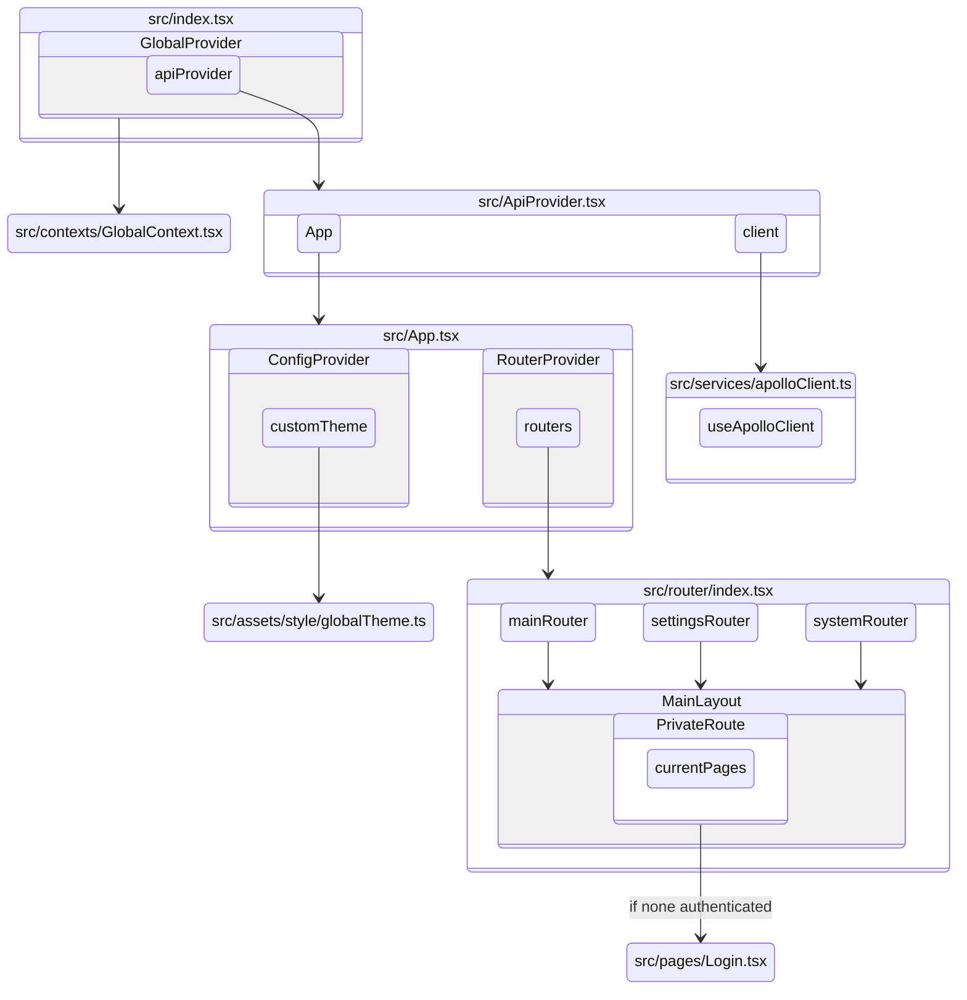

**About This Repository**
- This repository is for demonstration purposes only. The original source code is not included to maintain confidentiality.
- This `README.md` file details my methodology for structuring a complex front-end project, from its architecture and workflows to the detailed component and data flow management.

* [Project Structure](#project-structure)
  * [Folder Structure](#folder-structure)
  * [Project Architecture Diagram](#project-architecture-diagram)
* [Development Workflow](#development-workflow)
  * [Adding a New Page](#adding-a-new-page)
  * [API Development Flow](#api-development-flow)
* [Detailed Structure](#detailed-structure)
  * [MainLayout](#mainlayout)
  * [Menu](#menu)
  * [Router](#router)
  * [Context](#context)
  * [Hooks](#hooks)
  * [Utils](#utils)
  * [Environment Variables (.env)](#environment-variables-env)
* [Development Guidelines](#development-guidelines)
  * [Frameworks & Tools](#frameworks--tools)
  * [npm](#npm)
  * [Git Workflow](#git-workflow)
  * [Related Documents](#related-documents)

---

## Project Structure

### Folder Structure
```
Risk-Management-Frontend
├── src
│   ├── assets // Static assets
│   │   ├── images
│   │   ├── style
│   │   ├── types // Subfolders mirror project structure (graphql is flat)
│   │   ├── utils // Static js function
│   ├── configs
│   │   ├── chartConfigs // Charts configurations
│   ├── components // Avoid direct import, data fetching, or context usage unless specified
│   │   ├── commons
│   │   ├── MainLayout // Main app layout (header, menu). Allowed global APIs, contexts, and page-load logic.
│   │   │   └──MainMenu // Page menu configuration
│   │   │   ├── UserMenu
│   │   │   ├── SystemMenu
│   │   ├── PrivateRoute // Auth-protected route. Ensures page is only visible when authenticated. Allowed context usage.
│   └── contexts
│   └── graphql
│   │   ├── mutations
│   │   ├── queries
│   │   ├── lazyQueries
│   └── hooks
│   └── pages // Site page management (Pages must NOT be placed in /components)
│   └── router
│   └── services // Apollo client setup (includes refresh token logic)
│   └── ApiProvider.tsx // Imports the Apollo client from services
│   └── App.tsx // Handles app initialization (includes token verification)
│   └── index.tsx
├── .env // Environment variables
├── package.json
├── tsconfig.json
├── tsconfig.paths.json // tsconfig path aliases
```

---

### Project Architecture Diagram

1. `./src/index.tsx` is the entry point, containing `<GlobalProvider>` and `<ApiProvider>`.
2. `<ApiProvider>` imports the Apollo setup from `./services/apolloClient` and renders the main `<App>` component.


---

## Development Workflow

### Adding a New Page

1. Create the new page file in `pages/`.
1. Add the route configuration in the corresponding file under `router/`. (see [Router](#router))
1. Add the menu item in the corresponding file under `menu/`. (see [Menu](#menu))
1. Add the corresponding feature flag string to the `.env` variable.(see [Environment Variables (.env)](#environment-variables-env))

* Note: The page will only be visible when the key is correctly set in the `menu list`, `router` and `.env` file.
* menu.key === router.menuName === .env feature string.

### API Development Flow

1. Add the new API query/mutation in `graphql/`.
1. Import the query into the target page and use Apollo Client hooks for API integration.
1. Add relevant query types (variables & responses) in `types/`.

* The core Apollo Client configuration is located in `services/apolloClient`

---

## Detailed Structure

### MainLayout

### Menu
Linked with `router`, `.env`, and pages. See "Adding a New Page" for details.

Menu List Basic Structure
```
// `useMenu` hook checks if the page exists in the Menu API (permissionMenu) and converts it to Ant Design's Menu format.
{
  key: 'system_account_groups',
  link: 'account-groups',
  title: 'Account Group',
  icon: TeamOutlined,
},
```

Menu Structure
```
├── MainMenu
│   ├── Home ('/')
│   ├── Real Time ('/real-time')
│   ├── System Management ('/account-groups') // directed to SystemMenu
├── UserMenu
│   ├── Account ('account')
│   ├── Password ('password')
│   ├── Preferences ('preferences')
│   ├── Authentication Log ('/authentication-log')
├── SystemMenu
│   ├── Account Group ('account-groups')
```

### Router
Linked with `menu`, `.env`, and pages. See "Adding a New Page" for details.

Router List Basic Structure
```
  // (Page Name is typically the component name you import. Use `extendComponent` if sharing a component.)
  [Page Name]: {
    title: 'Create New Branch', // Title displayed in MainLayout
    path: '/account-groups/create-branch', // Route path
    crumb: ({ searchParams }: any) => [
      { title: 'System Management' },
      { title: 'Account Groups', link: 'account-groups' },
      { title: searchParams.get('branch') },
    ], // Breadcrumbs
    htmlTitle: ({ searchParams }: any) => `Edit Branch - ${searchParams.get('branch')}`, // <title> in the document head
    requiredParams: [{ param: 'branch', required: true }], // Required searchParams
    importPath: 'SystemManagement/', // Page folder
    menuName: 'system_account_groups', // Corresponding menu key (shared string with backend)
    extendComponent: 'EditBranch', // The page component to use (if shared)
    componentProps: { editType: EditAccountStatus.Edit }, // Props required by the Page Name component or extendComponent
  }
```

### Context
The entry point is GlobalContext
```
const globalContextValues = {
  theme: themeContext,
  authenticated: authenticatedContext,
  userSelf: userSelfContext,
  notification: notificationContext,
}
```
Context Contents
```
├── themeContext
│   ├── theme, setTheme // Light or Dark
├── authenticatedContext
│   ├── isAuthenticated, setIsAuthenticated // Login or not
│   ├── isForceLogout, setIsForceLogout // Controls the global "force logout" notification
├── userSelfContext
│   ├── username, setUsername
│   ├── userEmail, setUserEmail
│   ├── fontSize, setFontSize
│   ├── dateFormat, setDateFormat
│   ├── timeFormat, setTimeFormat
│   ├── negativeShowMinus, setNegativeShowMinus
├── notificationContext
│   ├── globalContextHolder // Placed within <GlobalContext.Provider> for global access
│   ├── openGlobalNotification
│   ├── globalNotificationSuccess // Show success notification
│   ├── globalNotificationError // Show error notification
```

### Hooks
| **Hook Name** | **Description** |
| ------------- | -------- | 
| `useLogin`    | Manages user login logic, including automatic redirection, error handling, and state management. |
| `usePageMount`| Handles shared logic and parameters for the `MainLayout`. **Includes:**<br>1. Menu collapse state (`collapsed`, `setCollapsed`, `toggleCollapsed`)<br>2. Page and breadcrumb data (`routerHandle`, `crumbs`)<br>3. Menu Permission API state (`MenuPermissionData`, `MenuPermissionError`, `MenuPermissionLoading`, `fetchMenuPermission`)<br>**Actions performed on mount:**<br>1. Redirects to home if required parameters are invalid.<br>2. Updates the document title for each page.<br>3. Re-fetches menu permissions on every page load. |

### Utils
| **Function Name** | **Description** | **Parameters** | **Returns** | **Example Input** | **Example Output** |
|--|--|--|--|--|--|
| `formatTimestamp` | Displays time elapsed since a given date. | `Date` | `string` | `(new Date(2025-02-20T06:36:07))` | "3 days ago"<br>"about 23 hours ago" |
| `GraphQLErrorMsg` | Returns a backend error message from an ApolloError or a default message. | `ApolloError` | `string` | `(GraphQLErrorMsg)` | "Data Fail"<br>(String from backend) |
| `formatNumber2Unit` | Formats large numbers with unit suffixes (e.g., K, M).<br>(Rules: 1.00K-9.99K (2 decimals),<br>10.0K-99.9K (1 decimal),<br>100K+ (0 decimals)) | `number` | `string` | `(10500)`<br>`(9999)` | "10.5K"<br>"9.99K" |
| `toCommas` | Adds commas as thousands separators. | `number` | `string` | `(10500)`<br>`(9999.85)` | "10,000"<br>"9,999.85" |
| `formatNegativeNumber` | Formats negative numbers. If `negativeShowMinus` is false, wraps in parentheses. | value:`number`,<br>negativeShowMinus:`boolean`,<br>extraSymbol?:`string` | `string` | `(-10500, false)`<br>`(-9999.85, true, '%')` | "(10000)"<br>"-9999.85%" |

### Environment Variables (.env)
```
// Version number displayed in the Menu
REACT_APP_VERSION=demo

// API endpoint URL
REACT_APP_API_PATH=https://api.your-service.com/

// Project title displayed in the Header
REACT_APP_TITLE=Risk Management System

// Feature flags for the project. Controls Menu and Router visibility.
// Strings must match backend definitions. Do not add spaces between commas.
REACT_APP_ACTIVE_MAIN_FEATURE=feature_home,feature_dashboard,feature_admin
REACT_APP_ACTIVE_SETTINGS_FEATURE=setting_profile,setting_password
REACT_APP_ACTIVE_SYSTEM_FEATURE=system_account_groups
```
---

## Development Guidelines

### framework & tools

- Front-end Framework: [React](https://reactjs.org/docs/getting-started.html).
- Use [TypeScript](https://www.typescriptlang.org/docs/) for managing JavaScript types.
- UI Library: [Ant Design](https://ant.design/docs/react/introduce).
- Linter: [ESLint](https://eslint.org/) to enforce consistent coding styles.
- API Integration: [GraphQL](https://graphql.org/learn/) & [Apollo](https://www.apollographql.com/docs/react).

### npm

- npm version `9.5.1`, node.js version `21.3.0`
- Run `npm run start` to start the development server.
- package.json script settings:
  e.g., to use `.env.production` for the `build:prod` script, add the following to package.json scripts:
  `”build:prod": "dotenv -e .env.production craco build"`

### Git Workflow

- Production branch: `main`.
- Development branch: `next`.
- All new features must be developed in their own `feature/...` branch.
- Use `git rebase` for merging and managing branches.
- Commit Message Conventions:
  - `feat`: A new feature
  - `fix`: A bug fix
  - `docs`: Documentation only changes
  - `style`: Changes that do not affect the meaning of the code (`white-space`, `formatting`, `missing semi colons`, etc).
  - `refactor`: A code change that neither fixes a bug nor adds a feature
  - `perf`: A code change that improves performance
  - `test`: Adding missing tests or correcting existing tests
  - `chore`: Changes to the build process or auxiliary tools
  - `revert`: Reverts a previous commit (e.g., `revert: type(scope): subject`)

### Related Documents
- Backend Documentation
- Postman Collection
- Page & UI Specifications
- GraphQL Playground

*(Note: Documentation links were internal to the organization and have been omitted for confidentiality.)*